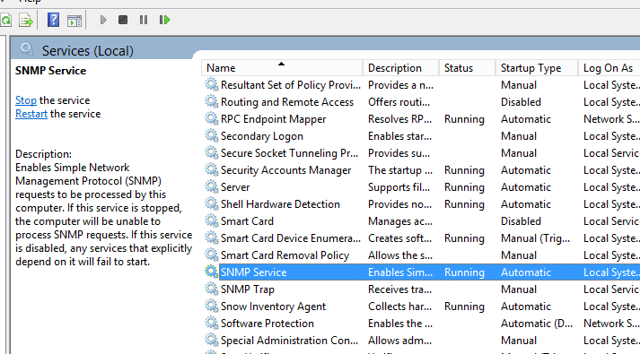
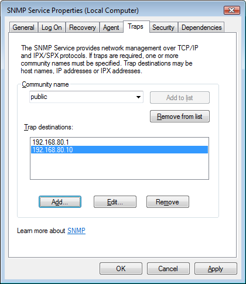
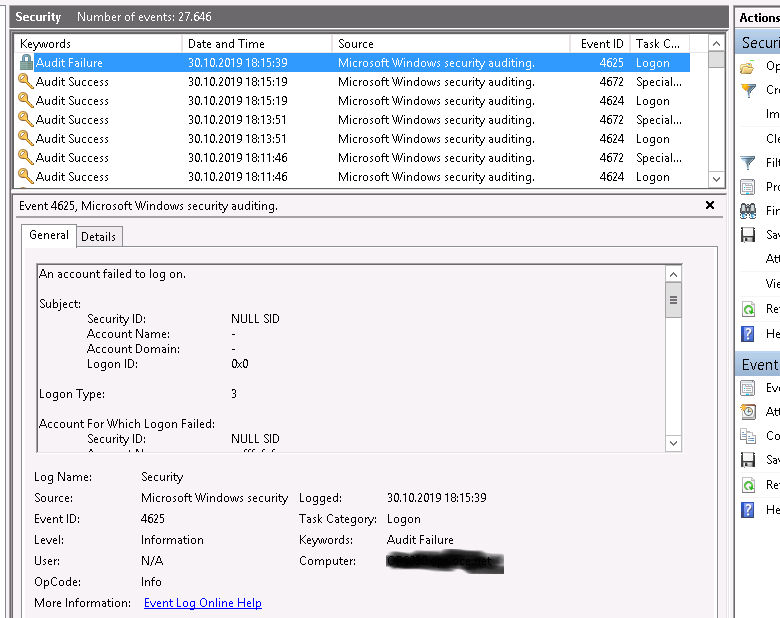
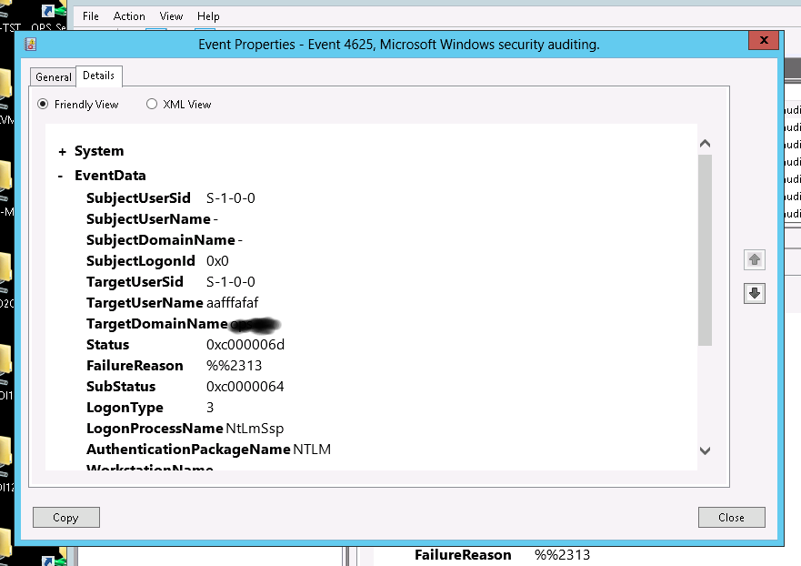
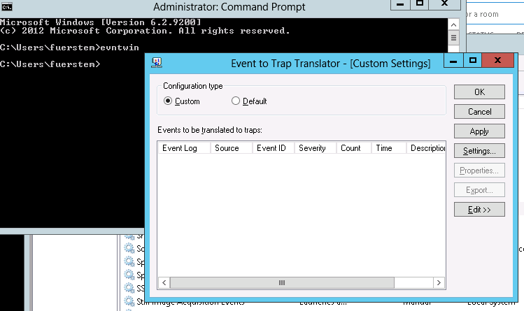
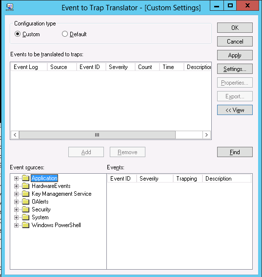
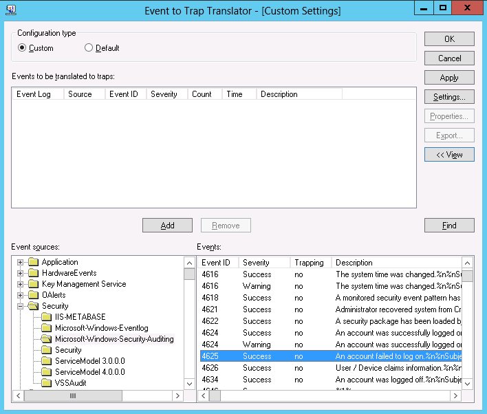
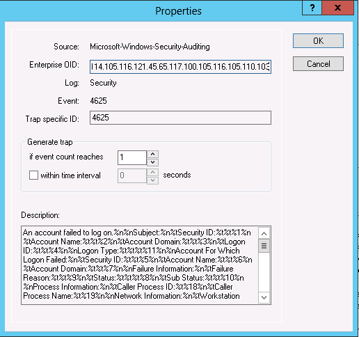
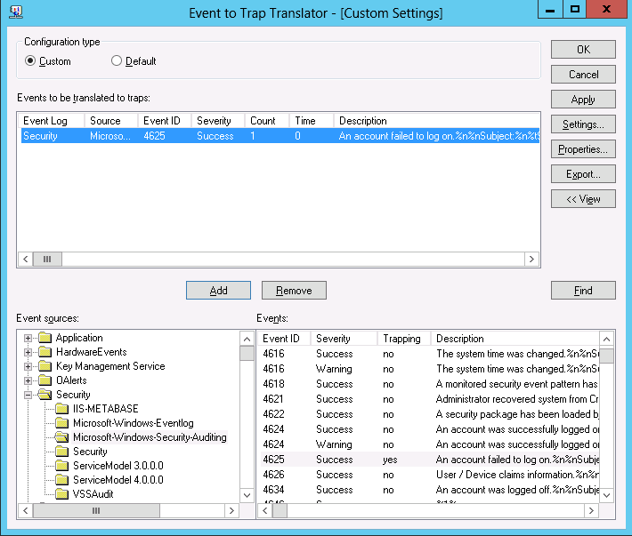

Windows Events as SNMP traps and how to process them
====================================================

General
-------

Sending Windows events as SNMP traps is part of Windows event system. The tool used for this is evntwin.exe.

Before using it the sending system must be configured.

**Note: You can send any event to Windows event system (batch file, Powershell etc.) but to be used a trap you need a valid message file / message catalog.**

Prerequisites
-------------

*   Ther server sending the traps must have a configured SNMP.
*   On Windows events traps must has been configured with evntwin/evntcli
*   On Linux snmptt ([http://www.snmptt.org](http://www.snmptt.org "http://www.snmptt.org")) must be running

MS Windows Configuration
------------------------

### Configure SNMP on MS Windows to send traps

In services go to SNMP Service and select it.



Next select the traps card:



Here you have to add the trap destination. This is

\- 192.168.80.1 (monitor.foo.net)

\- 192.168.80.10 (monitor-qa.foo.net)

The community string can't be changed but this is no problem. If this is done your system should be able to send traps.

### Configure events to send SNMP traps

As mentioned the tool doing this is evntwin.exe. Start it from the command line.

**Important note:** You can send for example any message to the Windows event log. But you can only process it with evntwin if you have a valid message file.

See:

*   [https://docs.microsoft.com/en-us/windows/win32/eventlog/message-files](https://docs.microsoft.com/en-us/windows/win32/eventlog/message-files "https://docs.microsoft.com/en-us/windows/win32/eventlog/message-files")
*   [https://docs.microsoft.com/en-us/windows/win32/wes/message-compiler--mc-exe-](https://docs.microsoft.com/en-us/windows/win32/wes/message-compiler--mc-exe- "https://docs.microsoft.com/en-us/windows/win32/wes/message-compiler--mc-exe-")
*   [https://docs.microsoft.com/en-us/windows/win32/eventlog/message-text-files](https://docs.microsoft.com/en-us/windows/win32/eventlog/message-text-files "https://docs.microsoft.com/en-us/windows/win32/eventlog/message-text-files")

How to find an event? Look into your event log.





To process an event we have to know the message source and the eventid.

Call evntwin.exe



Select Edit.



Now you bowse the tree to find the event definition you had found in your event log.



Select it.



Here you can configure the behaviuor. So for example that a trap is only send if the event occours 10 times in 60 seconds. If everything is ok \u2026..



Now the configured events will be sent to trap desiniation as SNMP traps.

If you the same configuration for different servers you

*   can export the configuration
*   copy the exported file to the destination server
*   import the file with evntcli

Configure your trap receiver on your monitor system
---------------------------------------------------

### Configure snmptt

For general installation and configuration follow the steps on [http://www.snmptt.org/docs/snmptt.shtml](http://www.snmptt.org/docs/snmptt.shtml "http://www.snmptt.org/docs/snmptt.shtml")

### Structure for a Windows event send as snmp trap

  Structure of OID:

```
.1.3.6.1.4.1.311.1.13.1.37.82.101.109.111.116.101.83.101.114.118.105.99.101.115.83.99.104.101.100.117.108.101.114.67.108.101.97.110.117.112.83.101.114.118.105.99.101.0.50100
 I I I I I I  I  I  I I  I  I                                                                                                                                         I   I
 I I I I I I  I  I  I I  I  +------------------------------------------------------------------+----------------------------------------------------------------------+   I  
 I I I I I I  I  I  I I  I                                                                     I                                                                          I
 I I I I I I  I  I  I I  I                                                           source name in ASCII characters                                                      I                                                                                                                                              I
 I I I I I I  I  I  I I  I                                                                                                                                                I
 I I I I I I  I  I  I I  I                                                                                                                                eventID <-------+
 I I I I I I  I  I  I I  +--> Number of characters in source name 
 I I I I I I  I  I  I I
 I I I I I I  I  I  I +--> evntagent
 I I I I I I  I  I  I
 I I I I I I  I  I  +--> evntlog
 I I I I I I  I  I
 I I I I I I  I  +--> software
 I I I I I I  I 
 I I I I I I  +--> microsoft
 I I I I I I
 I I I I I +--> enterprises
 I I I I I
 I I I I +--> private
 I I I I
 I I I +-> internet
 I I I
 I I +--> dod
 I I
 I +--> org
 I
 +--> iso
```

### Windows Event Types and how to ignore them
<p>Success (numerical 0)<br>
Error (numerical 1)<br>
Warning (numerical 2)<br>
Information (numerical 4)<br>
Audit Success (numerical 8)<br>
Audit Failure (numerical 10)<br></p>

The following options will be used to ignore unwanted types
<p>--ignoreAuditFailure<br>
--ignoreAuditSuccess<br>
--ignoreError<br>
--ignoreInformation<br>
--ignoreSuccess<br>
--ignoreWarning<br></p>

### Sample definition for snmptt

```
EVENT TheNumberOfTheBeast .1.3.6.1.4.1.311.1.13.1.19.84.104.101.78.117.109.98.101.114.79.102.84.104.101.66.101.97.115.116.0.666 "Status Events" Normal
REGEX (\\\`)(')g
FORMAT $\*
EXEC /usr/local/monitoring/win_events/wintrap2mon_2.0 --eventText="$1" --eventSystem="$3" --eventType="$4" --eventID=50100 --eventCategory="$5" --ignoreInformation --eventOID=$e --multiline --sd_mid=" Event:" --sd_after=" - technical error" --tolower
SDESC
Get the traps from the event system
Variables:
  1: eventText
  2: eventUserId
  3: eventSystem
  4: eventType
  5: eventCategory
  6: eventVar1 - same as eventText
  7: event\_OID
EDESC
```
**The REGEX is important becuse it may happen that the event contains backticks. For example if stacktraces are send as trap.**

The "normal" service description for the monitor will be generated by the Event Eource and the EventID. It can be enhenced by

1.  --sd_before=<string> String before generated service description (string + space + eventSRC + space + eventID).
2.  --sd_mid=<string> String in the middle generated service description (eventSRC + space + string + eventID).
3.  --sd_after=<string> String after generated service description (eventSRC + space + eventID + string).

These options can be combined.

### Helper tools

#### gen_oid_win_event

gen_oid_win_event will take EventID and Event Source as input and genereates the OID. With this little tool you can create the configuration for snmptt before getting the event as trap.

```
./gen_oid_win_event --eventID=666 --eventsrc=TheNumberOfTheBeast
.1.3.6.1.4.1.311.1.13.1.19.84.104.101.78.117.109.98.101.114.79.102.84.104.101.66.101.97.115.116.0.666
```
#### get_oid_win_event

get_oid_win_event will take a logged OID from snmpttunknown.log and outputs the Event Source and the EventID.

```
./get_oid_win_event --eventOID=.1.3.6.1.4.1.311.1.13.1.19.84.104.101.78.117.109.98.101.114.79.102.84.104.101.66.101.97.115.116.0.666
Event Source: TheNumberOfTheBeast
EventID: 666
```


### wintrap2mon options

```
wintrap2mon --eventID=<event ID> --eventText=<event message text> --eventSystem=<computername> --eventType=<numeric value the event type> --eventCategory=<numeric value event category.> --eventOID=<eventOID> [--ignoreAuditFailure] [--ignoreAuditSuccess] [--ignoreError] [--ignoreInformation] [--ignoreSuccess] [--ignoreWarning] [--service_description=<service_description> ] [--sd_before=<string>] [--sd_mid=<string>] [--sd_after=<string>]-c <cmdfile>|--commandfile=<cmdfile> |--alarm_reset] |--tolower] [--multiline]

-c, --commandfile=<cmdfile>                      The nagios command file (named pipe).
                                                 If not set default (optional).

                                                 /var/cache/naemon/objects/naemon.cmd

                                                 will take place.

    --alarm_reset                                With --alarm_reset set immediately after an alert an OK will be send
                                                 this behaviour is produce and log messages without any interaction
                                                 or freshness checks (optional).

                                                 The values are case insensitive. Everything entered from
                                                 letter up to the complete word is ok

    --ignoreAuditFailure                         Ignore audit failure (numerical 10)
    --ignoreAuditSuccess                         Ignore audit success (numerical 8)
    --ignoreError                                Ignore error (numerical 1)
    --ignoreInformation                          Ignore information (numerical 4)
    --ignoreSuccess                              Ignore success (numerical 0)
    --ignoreWarning                              Ignore warning (numerical 2)

    --service_description=<service_description>  Service Description from Nagios (Naemon, icinga...)
                                                 Normally it will be generated (source name + space + eventID)
                                                 With this option it can be overwritten. But in case of overriding
                                                 it must be the same for all systems. (optional) 

                                                 The following options cannot be used in conmjunction with --service_description!!

    --sd_before=<string>                         Service description string before generated (source + space event).
    --sd_mid=<string>                            Service description string in the middle generated (source + space event).
    --sd_after=<string>                          Service description string after generated (source + space event).

    --eventID=<event ID>                         The event ID used by MS Windows submitted
                                                 as last OID otf the trap.
    --eventText=<text>                           The event message text. The message data
                                                 is populated with the variable data below.
    --eventSystem=<computername>                 The name of the host that generated the event.
    --eventType=<value event type>               The numeric code value of the event type.
    --eventCategory=<value event category.>      The numeric code value of the event category.
    --eventOID=<eventOID>                        Enterprise trap OID in number format.

    --multiline                                  Multiline output in overview. This means
                                                 technically that a multiline output uses
                                                 a HTML <br> for the GUI instead of\n. Be
                                                 aware that your messing connections (email,
                                                 SMS...) must use a filter to file out the <br>.
                                                 A sed oneliner like the following the job:

                                                 sed 's/<[^<>]*>//g'

    -- tolower                                  It may happen that a Windows host sends its hostname
                                                in upper case letters but in monitor system it is defined
                                                as lower case. With this flag upper case will be converted to
                                                lower case.
```

### wintrap2mon configuration

There is basically nothing to configure except the location of the command pipe. This can be done by adjusting the followin line or by handing over the location with -c|\u2013commandfile=<cmdfile> option:

  ```
my $nag_pipe;                                             # The nagios command file (named pipe)
my $nag_pipe_def="/var/cache/naemon/objects/naemon.cmd";  # Default for the nagios command  file (named pipe)
```
  
Send traps for testing
----------------------

The easiest way is to use PowerShell ISE

Known problems
--------------

### Size of the traps

Windows can send traps up to maximum allowed size of events in the windows event system and wintrap2mon can process it. But sometimes the length of the traps is limited by firewalls etc.. For big traps you have to check.

### evntwin doesn't work as expected

evtnwin/evntcli seems sometimes to have a have o locking key in the registry. It's the threshold. Normally the key should be 0. But sometimes it switches to another value and it doesn't work. A collegue of mine (Richard Geelen) has written a little Powershell script to reset the key. It can be run on a regular basis or (if you have a heartbeat trap) could be executed via nsclient++.

```
  $val = Get-ItemProperty -Path Registry::HKEY\_LOCAL\_MACHINE\\software\\microsoft\\SNMP\_EVENTS\\EventLog\\Parameters -Name "Threshold"
if($val.Threshold -ne 0)
{
set-itemproperty -Path Registry::HKEY\_LOCAL\_MACHINE\\software\\microsoft\\SNMP\_EVENTS\\EventLog\\Parameters -Name "Threshold" -value 0
stop-service SNMP
start-service SNMP
}
```
  
At the end
----------

After this is all done a service check definition can be created in the monitor. Beware that the hostname of the of the check definition must match the hostname in the trap. It can happen that the the name in the trap is in uppercase letters while you existing checks are based on lowercase names. In this case add \u2013tolower to your snmptt event configuration file.
